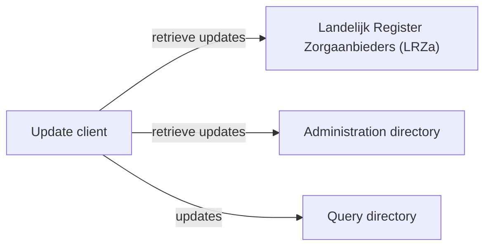

# Address book

The address book supports the _addressing_ generic function.

## Overview

The following diagram shows the components in the address book:



* The *administration directory* contains address information
* The *LRZa* contains references (endpoints) to the authoritative administration directory, per organisation
* The *query directory* contains an aggregate of authoritative address information
* The *update client* updates the query directory based on changes in the LRZa and administration directories

## Quick start

From the repository root directory, run:

```bash
docker compose --profile address-book up -d
```

This command starts FHIR servers with the following base URLs (this may take a while):

* http://localhost:8080/admin-directory
* http://localhost:8080/query-directory
* http://localhost:8080/lrza-mock

It will also start the address-book-seeder service to populate the administration directory and LRZa mock with test
data, and start the [demo client](../demo-client/README.md) on [http://localhost:8090/](http://localhost:8090/).

To stop and remove the containers, run the `docker compose down` command and specify the same profile as used in startup:

```bash
docker compose --profile address-book down -v
```

## Update client

The update client synchronizes the query directory with the LRZa and (authoritative) administrative directories.
The following command runs an update:

```bash
docker compose run update-client
```

For an initial run (or reset), run the update client using the `--full` option. The update client keeps track of the
time of last update, per administrative directory and LRZa. When the update client is run without any options, the
default is to run an incremental update since the last one. To start the incremental update at a given date, the
`--since` option can be used. For example:

```bash
docker compose run update-client --since=2025-12-17
```

## Test

The automated tests can be run using the following commands:

```bash
docker compose --profile address-book up -d # wait for startup
docker compose run address-book-test
```

Or to run a single test:

```bash
docker compose run address-book-test -- /home/node/address-book/test/src/simple.test.js
```

Running the test will add data to the LRZa mock, admin directory, and query directory. While it is generally possible to
run the test multiple times without a full tear-down and restart, for most consistent results it is better to run
`docker compose down && docker compose up -d` between runs.
